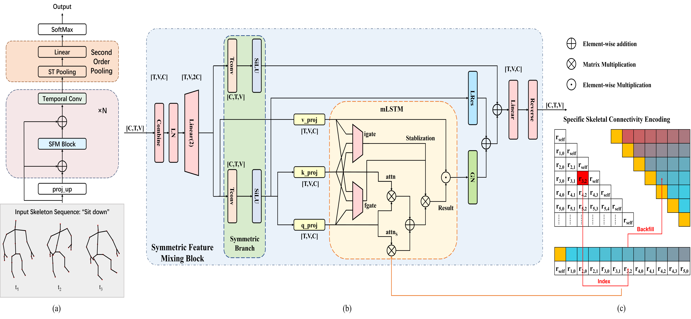
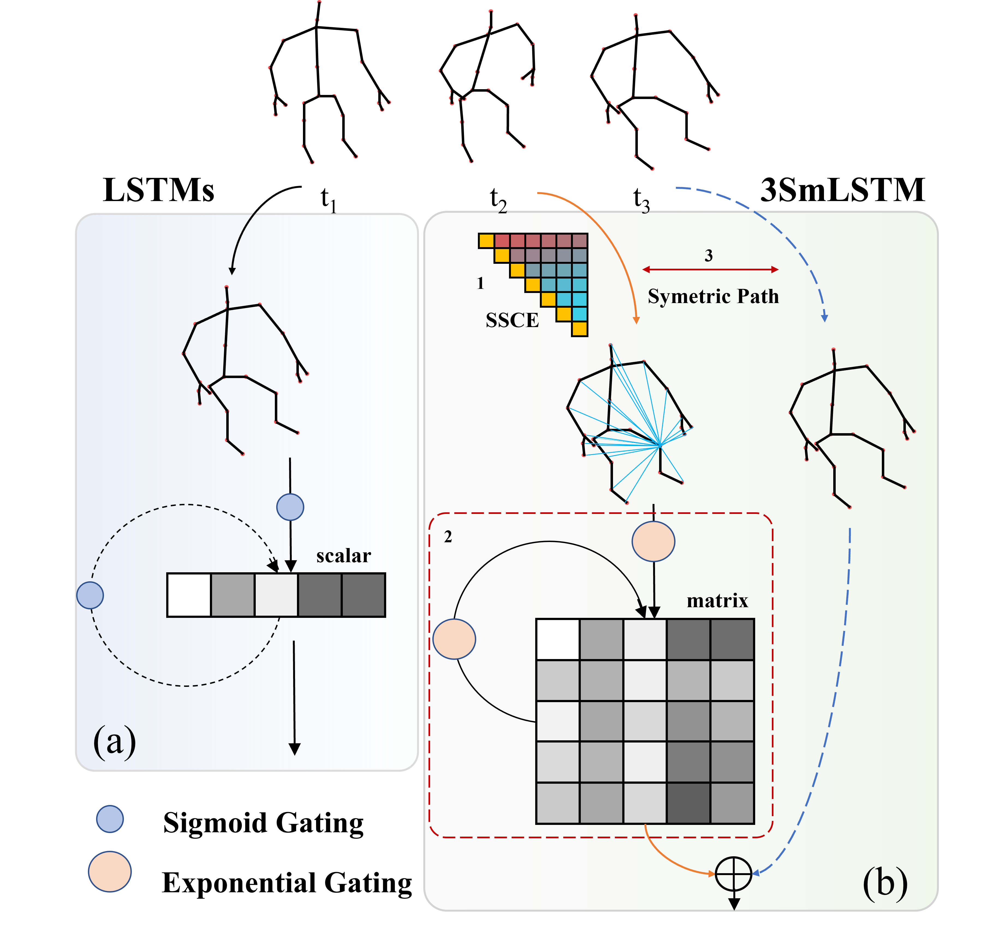
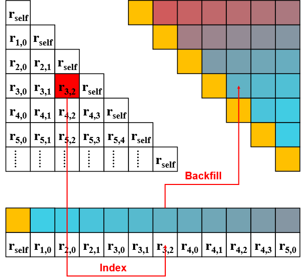
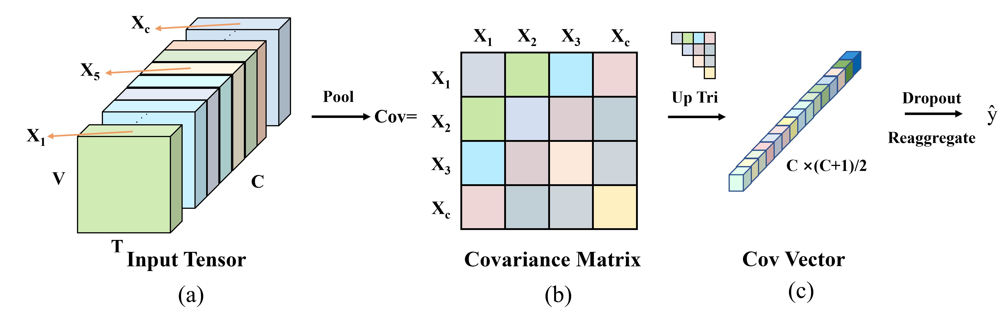

# 3SmLSTM
This is the official PyTorch implementation of our paper 3SmLSTM: Symmetric Feature Mixing MatrixLSTM with Specific Skeletal Connectivity Encoding for Skeleton-Based Action Recognition.

The paper is published in ICIC 2025 and can be accessed at [Springer](https://link.springer.com/chapter/10.1007/978-981-96-9908-7_20) or [BaiduNetdisk](https://pan.baidu.com/s/1iF2f5V97WYHfTuSGUFvnlA?pwd=1024).

## Efficiency
| Methods | Publication | Parameters | FLOPs | Acc on NTU 120 X-Sub | Acc on NTU 120 X-Set|
| -------- | ------- | ------- | -------- | -------- | -------- |
| MSS-GCN |  TCSVT 2024 |  7.0M | 9.7G |  88.9 | 90.6 |
| STFD-Net |  TCSVT 2024 |  4.3M | 2.89G |  89.3 | 90.9 |
| SelfGCN | TIP 2024 | 2.5M | 2.67G |  89.4 | 91.0 |
| SkeleFormer | PR 2026 | - | - |  89.7 | 90.8 |
| 3SmLSTM | ICIC 2025 | 2.0M | 2.60G |  89.9 | 91.2 |

###  3SmLSTM architecture
<p align="center">
   
</p>

### Comparison between LSTMs and our 3SmLSTM.
<p align="center">
   
</p>
 (a) LSTMs. With scalar memory and limited sigmoid gating. (b) The proposed 3SmLSTM. Including, 1. The specific skeletal connectivity encoding (SSCE), which
confers a degree of sequentiality to the joint sequences and ensures the preservation of topology during training. 2. mLSTM with larger matrix memory and exponential gating which enables wider range of control. 3. The symmetric temporal path capturing multi-scale temporal information while compensating for the non-sequential information through a branch without mLSTM.

### The Specific Skeletal Connectivity Encoding(SSCE).
<p align="center">
   
</p>

### Spatial-temporal second-order pooling.
<p align="center">
   
</p>


#  Preparation

### Download datasets.

#### There are 3 datasets to download:

- NTU RGB+D 60 Skeleton
- NTU RGB+D 120 Skeleton
- NW-UCLA

#### NTU RGB+D 60 and 120

1. Request dataset here: https://rose1.ntu.edu.sg/dataset/actionRecognition
2. Download the skeleton-only datasets:
   1. `nturgbd_skeletons_s001_to_s017.zip` (NTU RGB+D 60)
   2. `nturgbd_skeletons_s018_to_s032.zip` (NTU RGB+D 120)
   3. Extract above files to `./data/nturgbd_raw`

#### NW-UCLA

1. Download dataset from [CTR-GCN](https://github.com/Uason-Chen/CTR-GCN)
2. Move `all_sqe` to `./data/NW-UCLA`

### Data Processing

#### Directory Structure

Put downloaded data into the following directory structure:

```
- data/
  - NW-UCLA/
    - all_sqe
      ... # raw data of NW-UCLA
  - ntu/
  - ntu120/
  - nturgbd_raw/
    - nturgb+d_skeletons/     # from `nturgbd_skeletons_s001_to_s017.zip`
      ...
    - nturgb+d_skeletons120/  # from `nturgbd_skeletons_s018_to_s032.zip`
      ...
```

#### Generating Data

- Generate NTU RGB+D 60 or NTU RGB+D 120 dataset:

```
 cd ./data/ntu # or cd ./data/ntu120
 # Get skeleton of each performer
 python get_raw_skes_data.py
 # Remove the bad skeleton 
 python get_raw_denoised_data.py
 # Transform the skeleton to the center of the first frame
 python seq_transformation.py
```

# Evaluation

We provide the [pretrained model weights](https://github.com/StarPlatinumDa/3SmLSTM/tree/main/pretrained%20weights) for NTURGB+D 60 and NTURGB+D 120 benchmarks.

To use the pretrained weights for evaluation, please run the following command:

```
python main.py --weights pretrained weights/ntu 60/joint/runs-137-40778.pt --phase test --save-score True --config config/nturgbd-cross-subject/joint.yaml --device 0 --start-epoch 137 --model model.3SmLSTM.Model
```

# Training

```
python main.py --config config/nturgbd-cross-subject/joint.yaml --device 0 --base-lr 2.5e-2 --model model.3SmLSTM.Model
```

## Acknowledgements

This repo is based on [Hyperformer](https://github.com/ZhouYuxuanYX/Hyperformer) and [CTR-GCN](https://github.com/Uason-Chen/CTR-GCN). The training strategy is based on CTR-GCN.

Thanks to the original authors for their great work!

## Citation

Please cite this work if you find it useful.


