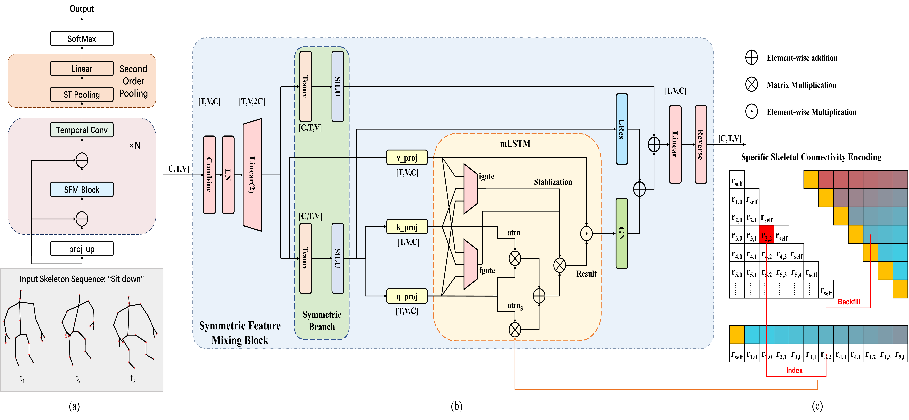

# 3SmLSTM
This is the official pytorch implementation of our paper 3SmLSTM: Symmetric Feature Mixing MatrixLSTM with Specific Skeletal Connectivity Encoding for Skeleton-Based Action Recognition

####  3SmLSTM architecture

   

